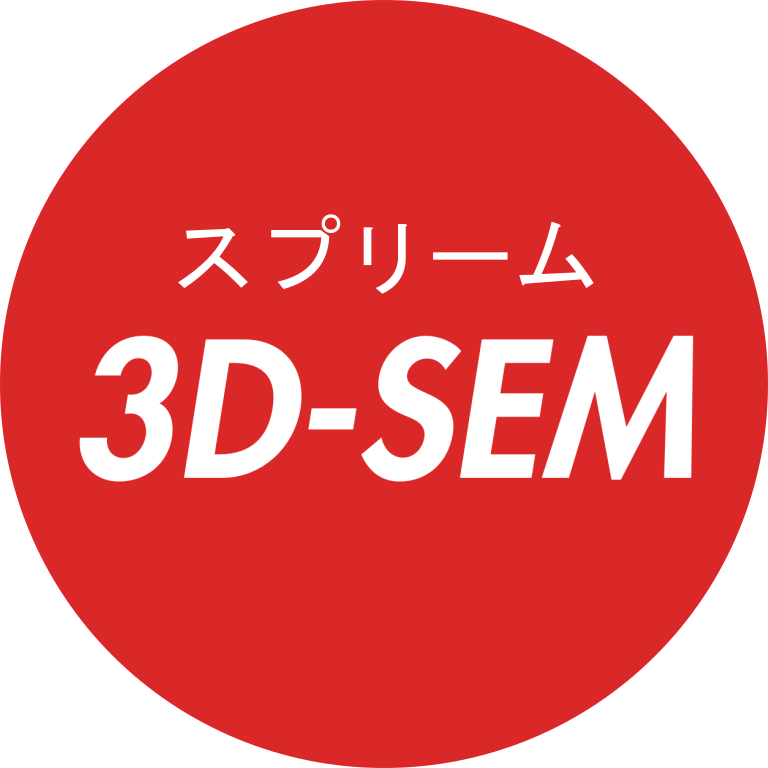
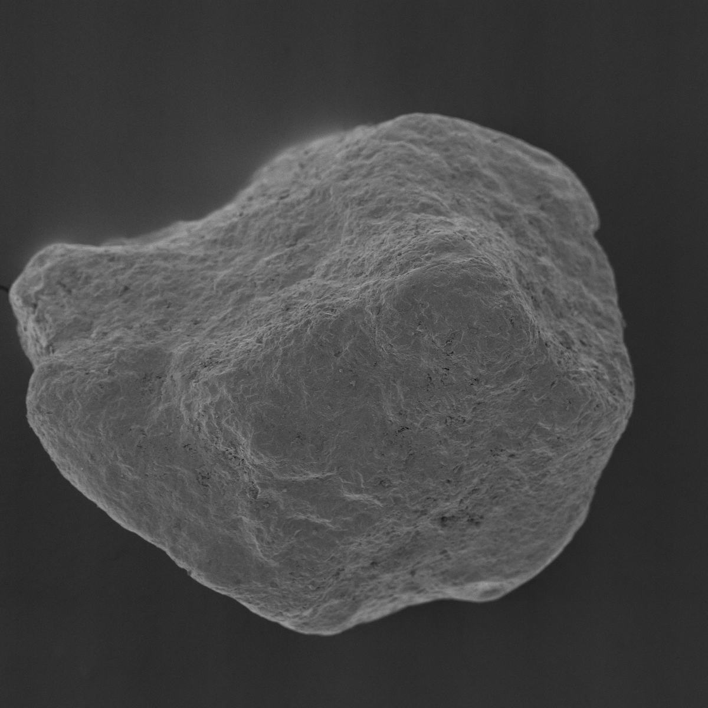
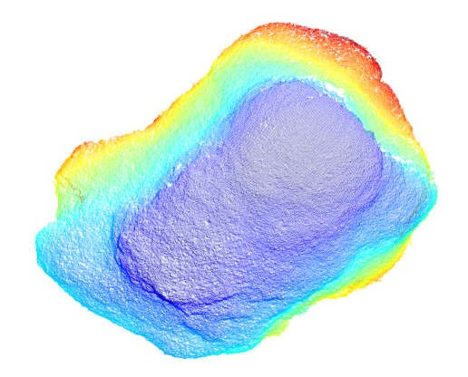
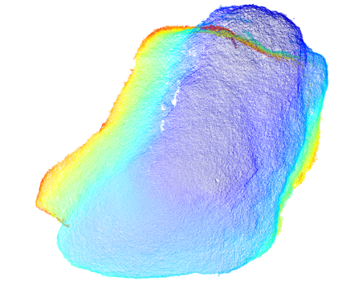
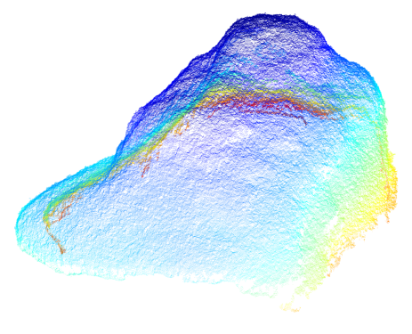

<p align="center">

</p>

# 3D-SEM
Demonstrative implementation of a 3D reconstruction routine in Python for SEM images using affine camera models
according to Töberg et al. [[1]](#1)<br>
Details about the theory underlying some of the implemented algorithms are elucidated in the
paper.<br> In addition, the paper gives some insights about the obtainable accuracy of the reconstruction results
 which should be similar to this implementation.<br>

The routine also performs, dependent on the configured config.py, a fully- or semi-automatic 
specimen
segmentation if desired. This segmentation is based on an initial segmentation by a U-Net model 
trained on an artificial data set of particle-like specimens. The segmentation can be subsequently
further refined by automatically or interactively creating a mask which is used to perform GrabCut. 
The U-Net model and two sets of example images are provided.
The tilting angles are computed via factorization so that at least a sequence of three images is needed.

If you use this code, please cite the following source as below: [[1]](#1)

## References
<a id="1">[1]</a> 
Töberg, S.; Reithmeier, E. 
Quantitative 3D Reconstruction from Scanning Electron Microscope Images Based on Affine Camera Models.
Sensors 2020, 20, 3598.
https://doi.org/10.3390/s20123598

## License
Copyright (c) 2023, Stefan Toeberg.
All rights reserved.

This source code is licensed under the BSD-style license found in the
LICENSE file in the root directory of this source tree.

(http://opensource.org/licenses/BSD-3-Clause)

## Image Acquisition
SEM images should be acquired by eucentrically tilting the stage which results in an orbital camera motion.
Other motions are also possible but not beneficial and tend to cause more work for the operator who aquires the images.
Suitable tilting angles range between 5°-10° dependent on the surface characteristics. (Flat surfaces generally allow the use of larger titling angles.)
In the tilting process, the focus should not be altered and a constant working distance should be kept.
Thus, only the stage on which the specimen is mounted should be adjusted.
The tilting angles do not have to be known. They are automatically computed via the selected factorization approach and printed in the console.

## Scale
The reconstructed point cloud is not scaled and given in pixel units. However, if a pixel constant for the used magnification and working distance
has been determined, the result can be scaled by this constant to get an idea of the specimen dimensions and surface depth. However, due to the projection characteristics of the SEM, the scale is actually only accurate
for the used working distance for which the scale was determined.

## Example Result

<div style="display: flex; justify-content: flex-start;">
    
    
       
       
</div>

## Installation - Ubuntu

For visualization and creation of virtual environments install the following packages:
```
sudo apt-get install python3-tk
sudo apt-get install python3-venv
```
Create a virtual environment using Python 3.10 and activate it:
``` 
python3.10 -m venv sem3d
source sem3d/bin/activate
```
Install the package from the package directory, for instance in editable mode:
(requirements are installed via the requirements.txt)
```
python3.10 -m pip install -e .
```
Add an image folder, configure the config.py to handle your specific use case and run the main via:
```
python3.10 ./main.py
```